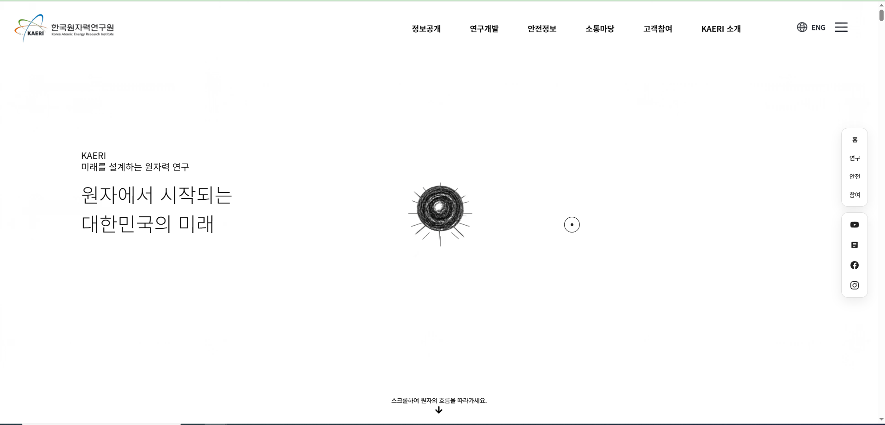

# 한국원자력연구원 웹사이트 리뉴얼

## KAERI Interactive Web Renewal

정보 중심의 공공기관 웹사이트를 연구 성과와 기술의 확장 과정을 스크롤로 경험할 수 있는 인터랙티브 전시형 웹사이트로 재해석한 프로젝트입니다.



## Links
* Live Site: https://sjian110-art.github.io/renewal-structure-fixed/
* GitHub Repository: https://github.com/sjian110-art/renewal-structure-fixed.git
* Project Plan: https://app.notion.com/p/Project-3-dcae67e4533883c6bac5810f7a7a5665
* Original Website: https://www.kaeri.re.kr/

## Project Overview
* 기존 정보 중심 공공기관 사이트를 스크롤 기반의 전시형 웹 경험으로 재구성
* 원자력 기술이 의료, 우주, 에너지 분야로 확장되는 과정을 하나의 이야기로 연결
* 복잡한 연구 정보를 단순히 나열하지 않고 장면과 인터랙션을 통해 직관적으로 전달
* 디자인, 인터랙션, 프론트엔드 구현 및 배포까지 진행한 개인 프로젝트

## Goals
* 공공기관의 신뢰성을 유지하면서 기존 사이트보다 현대적인 시각 경험 제공
* 원자력 기술의 활용 분야를 일반 사용자도 이해할 수 있도록 시각화
* 사용자의 스크롤을 이야기 진행 방식으로 활용
* 정보 탐색과 브랜드 경험을 함께 제공

## Story Flow
원자 형성 → MRI·의료 기술 → 우주선·우주 탐사 → SMR·에너지 → 사람과 심장 → 두 손의 연결 → 연구 분야 탐색

## Key Features
* 스크롤 진행도와 연결된 원자 형성 및 분열 장면
* 입자가 MRI 구조로 모이고 다시 분해되는 전환
* 우주선 구조 형성 및 우주 장면
* SMR 구조 형성과 에너지 장면
* 인체, 심장, 손 장면 (푸른 손과 주황색 손의 상호작용 및 흡수)
* 검은 배경과 흰 배경 사이의 전환 (마스크와 그라데이션을 통한 유기적인 장면 전환)
* 연구 분야를 탐색하는 원형 메뉴
* 의료·우주·SMR 이동을 위한 다이얼 
* 카드형 콘텐츠 전환 (3D 카드 뒤집기)
* 역방향 스크롤 시 장면 복원
* 상단 고정 내비게이션

## Technical Highlights
* **절차적 렌더링**: PNG 슬라이드가 아니라 선, 반투명 면, 입자를 조합해 MRI·우주선·SMR 구조를 절차적으로 표현 (`story-geometry.js`, `story-renderer.js`).
* **상태 동기화**: 형태 변화와 색상 전환을 같은 진행 단계(Stage) 값으로 연결하여 이질감 없이 부드럽게 구조와 컬러가 전환되도록 구현.
* **스크롤 위치 계산**: 역방향 스크롤 시 이전 방문 이력에 의존하지 않도록 위치 계산 로직을 절대적인 스크롤 위치에 기반해 처리하여 역스크롤 시 입자 위치 복원.
* **안정감과 역동성**: 완성된 구조물의 입자는 안정적으로 유지하고, 주변 에너지 요소와 외곽 곡선에만 움직임을 주어 형태 식별성과 역동성을 동시에 확보.

## Interaction
* 스크롤 스크러빙 (Scroll scrubbing)
* 장면 고정 및 Pin 처리 (ScrollTrigger 활용)
* 순차적 등장 및 퇴장 애니메이션
* 원형 메뉴의 선택·확대·블러 효과 (Focus 및 거리 기반 동적 블러)
* 카드 뒤집기 (3D Transform 기반 화면 전환)
* 메뉴와 다이얼 기반 이동 및 모달 인터랙션
* Canvas 2D 기반 입자 및 구조 렌더링

## Design Direction
* 과학적이고 미래적인 분위기 연출
* 공공기관의 신뢰성을 유지하는 정돈된 레이아웃 구성
* 의료(청록), 우주(보라), 에너지(파랑) 분야를 구분하는 색상 변화 적용
* 와이어프레임, 입자, 궤도와 에너지 곡선을 활용한 시각화
* 검은 화면과 흰 화면의 대비를 이용한 극적인 장면 전환
* 단순한 기술 과시보다 연구 성과가 사회와 연결되는 이야기를 중심으로 구성
* 주요 서체: Noto Sans KR (본문 및 UI), Outfit (영문 및 숫자 포인트)

## Tech Stack
* HTML5
* CSS3
* JavaScript (Vanilla)
* GSAP & ScrollTrigger
* Canvas 2D
* GitHub Pages

## Project Structure
```text
renewal-structure-fixed/
├── index.html
├── css/
│   └── style.css
├── js/
│   ├── atom-renderer.js
│   ├── card-flip.js
│   ├── menu-data.js
│   ├── script.js
│   ├── story-geometry.js
│   ├── story-renderer.js
│   └── video-scrubber.js
├── assets/
└── package.json
```

## Getting Started
1. 저장소 Clone
   ```bash
   git clone https://github.com/sjian110-art/renewal-structure-fixed.git
   cd renewal-structure-fixed
   ```
2. 패키지 설치 및 실행
   ```bash
   npm install
   npm run dev
   ```
3. 브라우저 캐시 때문에 이전 코드가 보일 경우 `Ctrl + Shift + R` (강력 새로고침)을 사용하여 확인합니다.

## My Role & Process
* 웹사이트 리뉴얼 방향 기획
* 스토리보드와 장면 순서 설계
* UI 및 인터랙션 디자인
* 시각 에셋과 장면 구성
* 스크롤 기반 프론트엔드 구현
* 테스트와 반복 수정
* GitHub Pages 배포
* AI 도구를 활용한 스토리 구조, 시각 장면 및 구현 보조
* 화면 순서, 전환 속도, 색상, 장면 구성과 최종 선택은 디자이너가 직접 검토하고 수정

## Challenges & Solutions
1. **MRI·우주선·SMR의 형태 식별성 부족**
   * 해결: 구조별 지오메트리를 분리하고 선, 반투명 면, 입자를 조합해 형태 개선.
2. **형태와 색상 전환 시점 불일치**
   * 해결: 공통 진행 단계(Stage) 값을 사용하여 구조와 컬러 전환을 동기화.
3. **역방향 스크롤 시 입자 위치 오류**
   * 해결: 이전 방문 이력에 의존하지 않도록 위치 계산 로직을 스크롤 절대 위치 기반으로 재정리.

## Improvements
* 모바일 및 다양한 기기 성능 최적화
* 접근성과 키보드 탐색 강화
* 저사양 환경에서 입자 수와 렌더링 성능 자동 조절
* 이미지 및 영상 로딩 최적화
* 실제 콘텐츠와 연구 데이터 연동 가능성 모색

## Disclaimer
본 프로젝트는 개인 포트폴리오 목적으로 제작한 비공식 웹사이트 리뉴얼이며, 한국원자력연구원의 공식 웹사이트가 아닙니다.
* 사용된 한국원자력연구원의 로고, 명칭과 자료 등 해당 권리는 원저작권자에게 있습니다.

## Creator
* Designer & Developer: LEE JIYEON
* © 2026 LEE JIYEON. All rights reserved.
